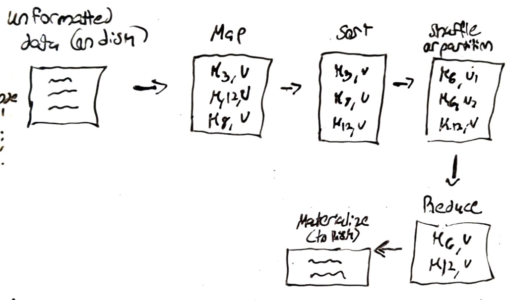

## System Design: MapReduce 
- map reduce allows us to perform batch processing of big data sets by utilizing nodes to apply custom transformations on the data
	- works with dats already in HDFS 
	- each node runs arbitrary code, just define mapper & reducer 
	- runs computations on same notes that hold data
	- restarts failed mappers and reducers independently 

	
## Job Chaining: 
- map reduce transforms data on disk to data on disk; this can be piped to another job 
- more advanced processing can be done via job chaining and data joins 
- Conclusion: its not used very much; not most efficient solution