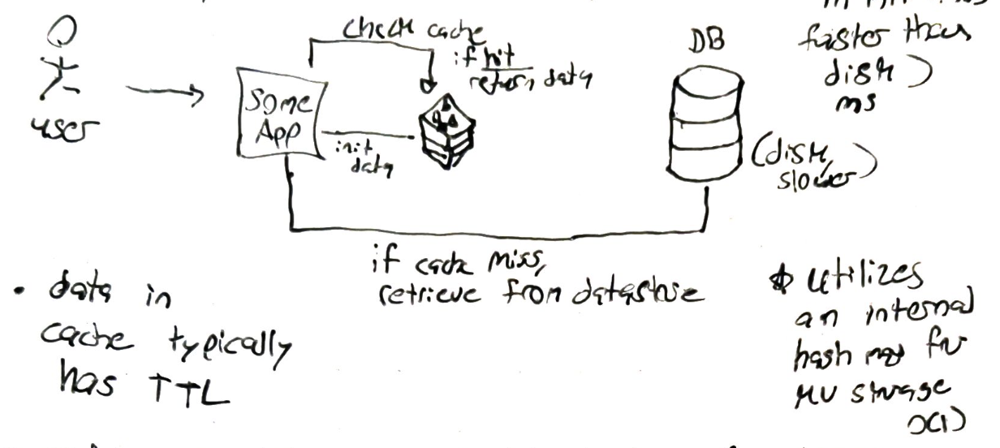
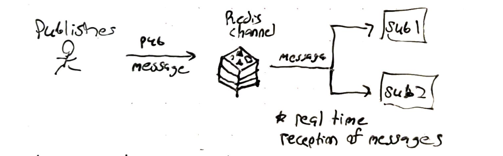
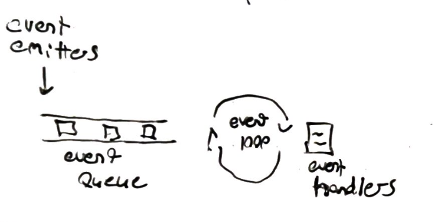

# System-Design: Why is Redis so fast? 

## Background 
- Redis stands for remote dictionary store; it can handle 100,00 QPS; typically used for in-memory cache (stores data in RAM (ns) and is faster thas disk (ms) 

	

- data in cache typically has a TTL and is evicted via LFU or LRU eviction policies
- redis ustilizes a hash map for key-value storage and retrieval in constant time (O(1))
- redis can utilize several data structures for storage such as (sorted sets, hashmaps, geo indexes, etc.)
- redis also has its own pub-sub feature `Redis channels` 

	

- redis can also be used as the primary DB leveraging an Append-Only-Log (AOL) to persist data to disk 

## Why its fast

### Single Threaded Model
- redis utilizes a single threaded model via an event queue, event loop, & event handlers for concurreny and non blocking io 
	- this gives it the ability to deal with race conditions and provides isolation 

	

- to handle more memory taking processes, Redis does horizontal scaling and `single leader replication` via `Redis Cluster` 4 redis uses single-leader replication 

### Written in C
- redis uses manual memory allocation & de-allocation via the C programming language to manage memory directly w/o overhead 
- C Code is compiled directly to binary and quickly executed