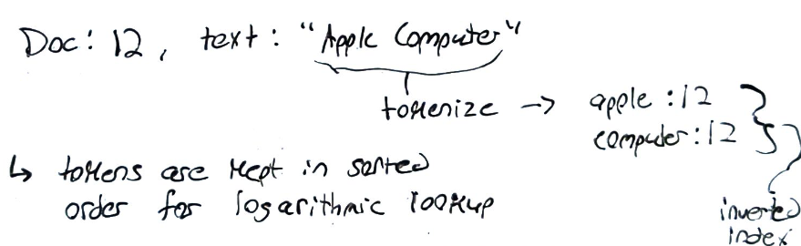

# System Design: Search Indexes 

- Databases don't solve the problem of parsing large amounts of text for something specific; they don't search text well
	- they don't consider substrings 
	- we need **search indexes** to save the day

## Search Indexes:

- `search indexes` parse text into `tokens` - these can be thought of as keywords - that can be found in documents using
- instead of storing indexes to tokens, data is stored using `inverted indexes` (tokens to indexes/documents that the token is associated with); this is called `tokenization` (e.g. "basketball": 1,43,67,120)

  

- tokens are kept in sorted order for logarithmic lookup (O(logn))
- tokens may be associated with multiple indexes 

  

- `prefix search` can be done in O(logn) time (e.g. "Find all documents that have words Starting with 'b'")
- `suffix search` can be created by storing a copy of the inverted index with a reversed token (e.g. "find the documents for words ending with berry" => "yrrebkcalb": 92; the reversed tokens are matched agaist the reverse string of the search "yrreb" to find the suffix) 

## Apache Lucene:
- `apache lucene` is a popular opensource search index (1999) 
- it uses `LSM architecture` to support fast document ingestion 
- it supports many types of indexes 

## Elastic Search: 
- `elastic search` is a wrapper for Lucene to allow for fast searching in a distributed system 
- it provides a REST API, custom query language, managed replication & partitioning, and visualization 
- Elastic Search maintains a local index per node for less duplication of actual documents
  - this is ideal for all searches to be limited to a single partition, otherwise multiple partitions must be queried and data aggergated

## Caching in Elastic Search:
- parts of a query are cached that may be common (e.g. "search for **shoes** - (uncommon; not cached) that are on **sale** - (common; cached)")
